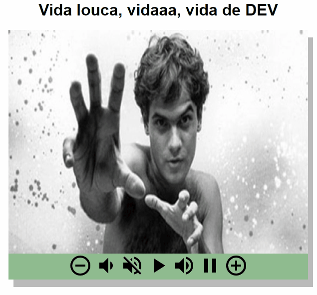

<h1 align="center"> Reprodutor de áudio </h1>

     - <a href="#objetivo">Objetivo</a>
    - <a href="#projeto">Projeto</a>
    - <a href="#tecnologias">Tecnologias usadas</a>
    - <a href="#autor">Autor do projeto</a>

# Objetivo

-   Criar um reprodutor de áudio, usando JS para criar um painel de controle, a partir de imagens.
-   Desafio do curso desenvolvedor web full stack, modulo HTML avançado.

# Projeto

# Tecnologias

-   HTML
-   CSS
-   JavaScript

# Autor

Bruno Vieira [see my linkedIn](https://www.linkedin.com/in/bruno-vieira-861633211/);
